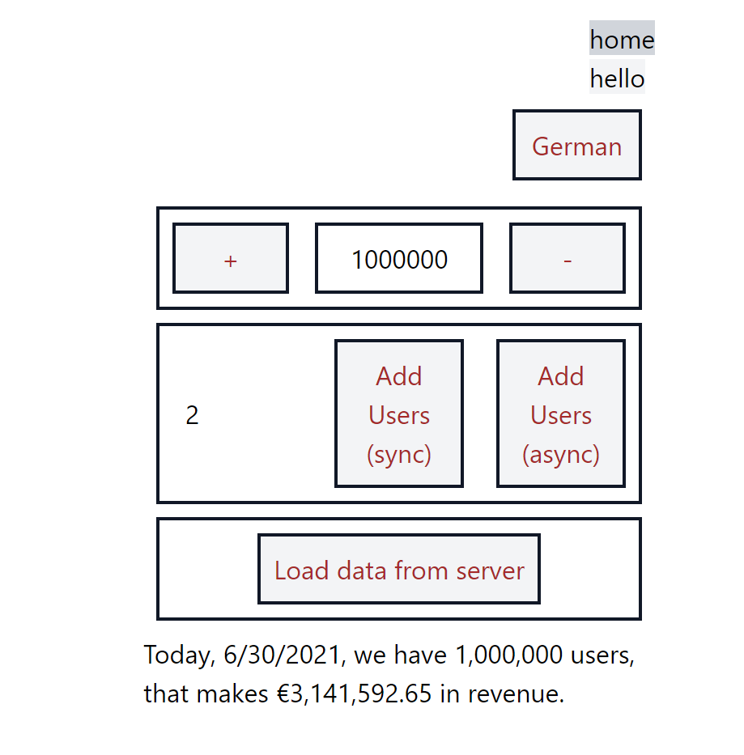
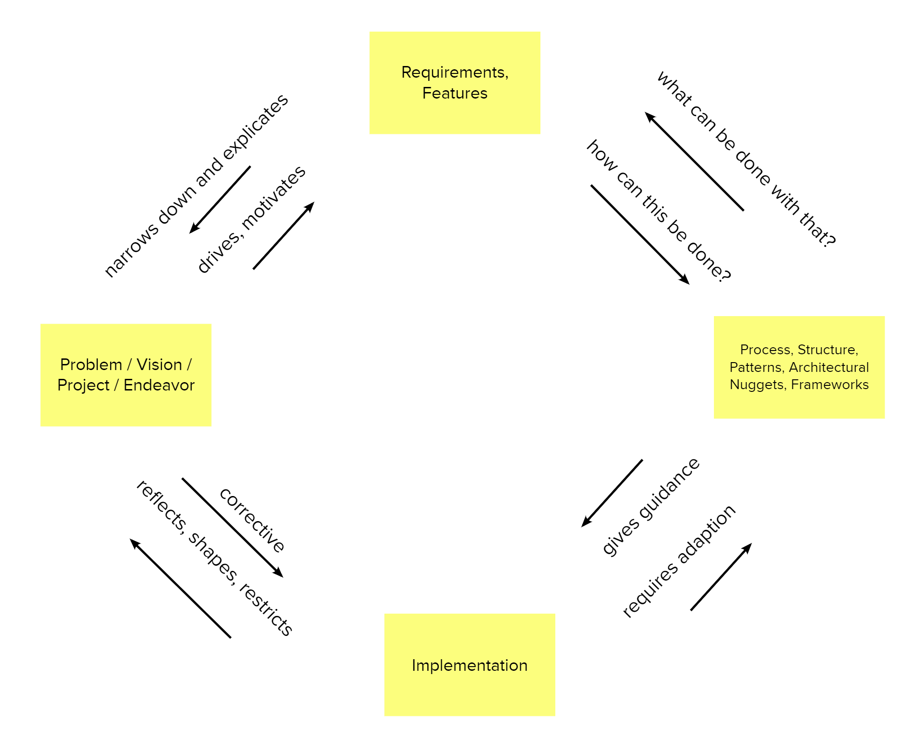

# Showcase: React for business applications

__Given the typical technical and structural requirements of a business application what are the recommended technology choices and architectural nuggets?__

## Architecture / Tech

This is my recommended tech stack for a typical enterprise application. Underlying assumptions of most important requirements
- Long service life (often more than 10 years) and thus good maintainability
- Development with several teams and members changing over the years 
- Good structuring possibilities for large and complex applications 
- Fast development speed

http://blog.embarc.de/spicker/#9

## Is architecture just clueless talking and useless Visios? (Well, it can be...)

Architecture is the sum of the important Processes, Structures, Patterns, Architectural Nuggets and Frameworks. Important can mean

* _hard to change, but somewhat risky_, 
* _affecting many teams/people or large parts of the software_, 
* _restricting what can be built reasonably_, 
* _having the potential to make the endeavor fail_. 

Idea of Architectural Nuggets taken from: https://pkruchten.files.wordpress.com/2020/06/kruchten-2020-northrop-award.pdf

Also from Kruchten: _The life of a software architect is a long and sometimes
painful succession of suboptimal decisions taken partly in the dark._

Definition of architecture inspired by: https://martinfowler.com/architecture/

## Most important Architectural decisions

### Framework

- https://2020.stateofjs.com/en-US/technologies/front-end-frameworks/
- https://tsh.io/state-of-frontend/#frameworks
- https://medium.com/javascript-in-plain-english/javascript-frameworks-performance-comparison-2020-cd881ac21fce
- https://djcordhose.github.io/spa-workshop/2020_arch.html#/frameworks
- https://reactjs.org/

### State Management

- https://2020.stateofjs.com/en-US/technologies/datalayer/
- https://djcordhose.github.io/spa-workshop/2020_arch.html#/innere-struktur
- https://djcordhose.github.io/spa-workshop/2020_arch.html#/state-management
- https://nilshartmann.github.io/react-training/2020_1211_react.html#/t-state
- Redux
  - https://redux.js.org/
  - https://redux-toolkit.js.org/
    - Motivation
      - "Configuring a Redux store is too complicated"
      - "I have to add a lot of packages to get Redux to do anything useful"
      - "Redux requires too much boilerplate code"
    - https://redux-toolkit.js.org/usage/usage-with-typescript
    - https://redux.js.org/faq/code-structure#how-should-i-split-my-logic-between-reducers-and-action-creators-where-should-my-business-logic-go
      - "Find the balance between these two extremes, and you will master Redux."
    - Effects ngrx-style: https://github.com/davidkpiano/useEffectReducer
- MobX
  - https://mobx.js.org/react-integration.html
  - https://michel.codes/blogs/mobx6
  - https://nilshartmann.github.io/react-training/2020_1211_react.html#/t-mobx
- XState
  - https://github.com/davidkpiano/xstate
  - https://github.com/davidkpiano/xstate/tree/master/packages/xstate-react
  - https://codesandbox.io/s/xstate-react-typescript-template-wjdvn?file=/src/index.tsx
- Comparison based on single/multi and direct/indirect: https://twitter.com/DavidKPiano/status/1353712136372039682
  - "state management is the wild west and the categories aren't mutually exclusive (and can become each other with abstractions/convention), so it's a rough categorization"
  

### Macro-Structure of modules and dependencies
#### Modular Monolith
- Development in a monorepo
  - https://lerna.js.org/
  - https://classic.yarnpkg.com/en/docs/workspaces/
- Code Splitting: 
  - https://create-react-app.dev/docs/code-splitting
  - https://reactjs.org/docs/code-splitting.html#route-based-code-splitting
- Make or buy lib
- CSS or Component lib?
  - don't mix well
- Build your own lib
  - https://classic.yarnpkg.com/en/docs/workspaces/
  - https://lerna.js.org/
  - https://blog.harveydelaney.com/creating-your-own-react-component-library/
  -  modes of maintenance
    1. corporate: use is mandatory for all, high risk in quality and suitability of lib
    2. agile: use recommended, usage shows quality and suitability of lib
  -  ownership?
  -  What to publish?

#### Micro Frontends
- https://micro-frontends.org/
- https://the-tractor.store/
  - https://github.com/naltatis/micro-frontends-in-action-code
- Server-Side Integration
  - SSI (Server-Side Include): http://nginx.org/en/docs/http/ngx_http_ssi_module.html 
  - Pure Verticals: Separate apps using classic links
- Client-Side Integration
  - iFrame: https://developer.mozilla.org/en-US/docs/Web/HTML/Element/iframe
  - WebComponent: https://developer.mozilla.org/en-US/docs/Web/Web_Components
  - AppShell: https://developers.google.com/web/fundamentals/architecture/app-shell 

### Micro-Structure within a module

- Smart Components: `Counter.tsx`
- Dumb Components: `AriaButton.tsx`
- http://blog.embarc.de/spicker/#9

### Testing

[Dedicated document](./testing.md)

### Styling

* styling is a global concern 
* often underestimated
* a real architectural decision
* don't mix different approaches

#### Options for writing styles
* using globally shared CSS
  * maybe using CSS framework
    * https://tailwindcss.com
      * https://marketplace.visualstudio.com/items?itemName=bradlc.vscode-tailwindcss
      * https://tailwindcss.com/docs/optimizing-for-production
      * https://github.com/DJCordhose/frontend-monorepo/blob/main/packages/counter/tailwind.config.js
    * don't mix with component library
  * https://github.com/DJCordhose/frontend-monorepo/blob/main/packages/counter/src/index.tsx#L3
* CSS modules
  * mainstream
  * https://create-react-app.dev/docs/adding-a-css-modules-stylesheet/
  * https://github.com/DJCordhose/frontend-monorepo/blob/main/packages/zeigermann-component-lib/src/LoadingIndicator.tsx
* SASS
  * Generally, we recommend that you don’t reuse the same CSS classes across different components. For example, instead of using a .Button CSS class in `<AcceptButton>` and `<RejectButton>` components, we recommend creating a `<Button>` component with its own .Button styles, that both `<AcceptButton>` and `<RejectButton>` can render (but not inherit).
  * can be used for global CSS
  * https://create-react-app.dev/docs/adding-a-sass-stylesheet/
  * https://github.com/DJCordhose/frontend-monorepo/blob/main/packages/counter/src/common/components/LoadingIndicator.tsx
* Styled Components
  * https://styled-components.com/
  * https://github.com/DJCordhose/frontend-monorepo/blob/main/packages/counter/src/features/hello/Hello.tsx  

#### Tooling
* https://postcss.org/
  * checks CSS and adds browser specific prefixes
  * can also bundle, minimize, source maps
* styling with TS
  * generic type declarations needed for CSS: https://github.com/DJCordhose/frontend-monorepo/blob/main/packages/zeigermann-component-lib/src/react-app-env.d.ts#L58
  * specific types can be generated
    * https://github.com/DJCordhose/frontend-monorepo/blob/main/packages/zeigermann-component-lib/src/AriaButton.module.css.d.ts
    * https://github.com/DJCordhose/frontend-monorepo/blob/main/packages/zeigermann-component-lib/rollup.config.js#L10

### Typing

- https://2020.stateofjs.com/en-US/technologies/javascript-flavors/
- https://djcordhose.github.io/spa-workshop/2020_arch.html#/ts
- https://djcordhose.github.io/spa-workshop/2020_js_ts_intro.html#/ts
- https://www.typescriptlang.org/
- https://www.typescriptlang.org/docs/handbook/react.html
- https://react-typescript-cheatsheet.netlify.app/
- https://github.com/piotrwitek/react-redux-typescript-guide#react--redux-in-typescript---complete-guide
- Advise
  - Don't overdo it
    - You can go a long way, but you probably shouldn't: https://github.com/gcanti/fp-ts
  - Libraries (shared code, also completely internal) can benefit from a lot of typing
  - Application code mainly benefits from typing
    - Often simply making a component TS can bring a huge benefit without adding any type information at all
- Type vs Interface: https://nilshartmann.github.io/typescript-intro/2021_js_ts.html#type-vs-interface

## Less important technical recommendations

### Component Style (classes vs functional components w/ hooks)
* classes and functional components are pretty similar
  * State: re-render
  * Properties
  * Component returns UI
  * Declarative
  * Lifecycle: render and commit phase
  * Classes and functions can be mixed in one app
  * Classes are not deprecated
    * https://reactjs.org/docs/hooks-faq.html#do-i-need-to-rewrite-all-my-class-components
* but  
  * new/future React features may only be available for functions
    * https://reactjs.org/docs/hooks-faq.html#should-i-use-hooks-classes-or-a-mix-of-both 
  * error boundaries only work for classes: https://reactjs.org/docs/error-boundaries.html
  * life-cycle methods in classes hurt cohesion of code and are error prone
  * useEffect can replace all of them in functional components (but also have a weird api)
  * setState and this-binding of callbacks in classes can be confusing
  * hooks might allow to better extract reusable code (rather than subclassing)
### Data Fetching and Synchronization
- low level
  - just fetch (built-in): https://developer.mozilla.org/en-US/docs/Web/API/Fetch_API
  - axios (isomporphic): https://axios-http.com/
  - fair comparison of both: https://blog.logrocket.com/axios-or-fetch-api/
- high level
  - for redux toolkit: https://redux-toolkit.js.org/rtk-query/overview
  - Alternatives: https://react-query.tanstack.com/comparison
- Polling
  - Long Polling
    - make call to server in useEffect
    - once call comes back, do it again
    - can be done in Redux Action Creator
  - Short Polling
    - simple: schedule call to server every x ms using setInterval
    - use lib like:
      - https://react-query.tanstack.com/examples/auto-refetching
      - https://redux-toolkit.js.org/rtk-query/usage/polling
  - Web Sockets
    - https://developer.mozilla.org/en-US/docs/Web/API/WebSockets_API/Writing_WebSocket_client_applications
    - useEffect: https://www.pluralsight.com/guides/using-web-sockets-in-your-reactredux-app
    - Redux Middleware: https://dev.to/aduranil/how-to-use-websockets-with-redux-a-step-by-step-guide-to-writing-understanding-connecting-socket-middleware-to-your-project-km3
  - Server-Sent Events
    - only one direction
    - patterns for receiving like Web Sockets
    - https://developer.mozilla.org/en-US/docs/Web/API/Server-sent_events/Using_server-sent_events
  - Abstraction over all methods: 
    - https://socket.io/
      - Java Implementation exists, but might be complex: https://github.com/socketio/socket.io-client-java
      - More server side implementations: https://socket.io/docs/v4/#What-Socket-IO-is
    - https://github.com/sockjs/sockjs-client

### Dependency Management

- https://classic.yarnpkg.com/en/

### Routing

- https://github.com/ReactTraining/react-router
- Routing and Redux
  - Deprecated: https://github.com/reactjs/react-router-redux
  - "official" answer - don't: https://stackoverflow.com/questions/36722584/how-to-sync-redux-state-and-url-hash-tag-params/36749963#36749963

### i18n, l10n

- https://react.i18next.com/
  - https://www.i18next.com/translation-function/interpolation
  - https://github.com/i18next/react-i18next
  - https://developer.mozilla.org/en-US/docs/Web/JavaScript/Reference/Global_Objects/Intl
- Deprecated
  - https://momentjs.com/
  - http://numeraljs.com/

### Build / Deployment

- `yarn build`
- https://create-react-app.dev/docs/deployment/ 
- https://create-react-app.dev/docs/deployment/#github-pages

### Component Libraries

- https://material-ui.com/
- https://github.com/microsoft/fluentui

### Performance
* web vitals
  * https://create-react-app.dev/docs/measuring-performance/
  * https://web.dev/vitals/
  * https://github.com/DJCordhose/frontend-monorepo/blob/main/packages/counter/src/index.tsx#L33
* Profiling Tools Browser
  * Standard Dev Tools
  * React Profiler: https://reactjs.org/blog/2018/09/10/introducing-the-react-profiler.html
  * Lighthouse (more high level): https://developers.google.com/web/tools/lighthouse

## Create React App

This project was bootstrapped with [Create React App](https://github.com/facebook/create-react-app), using the [Redux](https://redux.js.org/) and [Redux Toolkit](https://redux-toolkit.js.org/) template.

### Creation
- https://github.com/reduxjs/cra-template-redux-typescript
  - yarn create react-app my-app --template redux-typescript
- yarn upgrade typescript --latest
