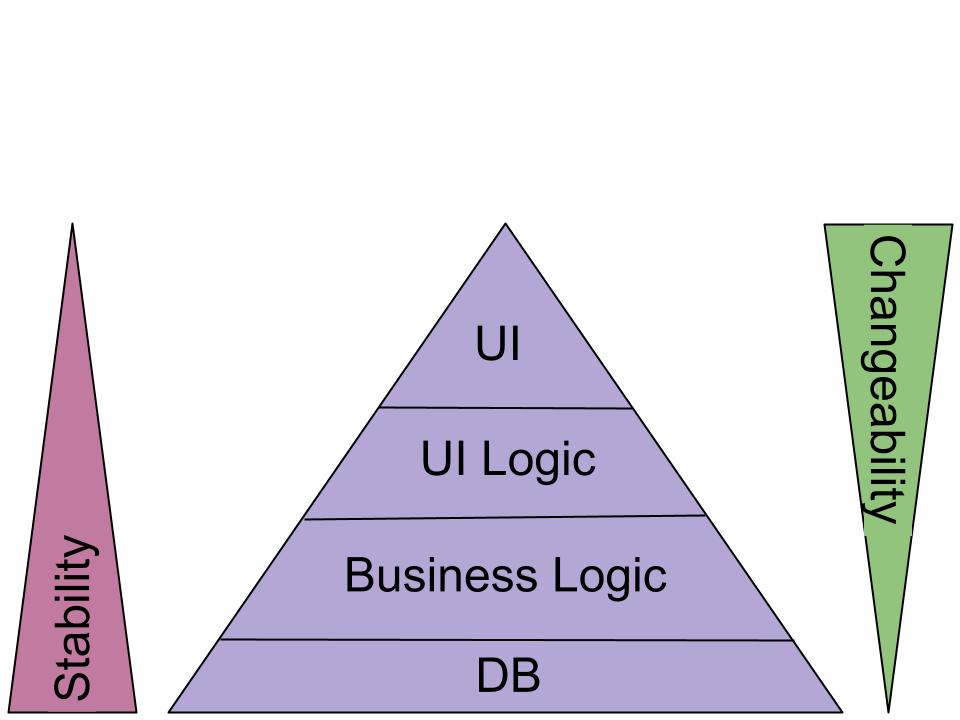
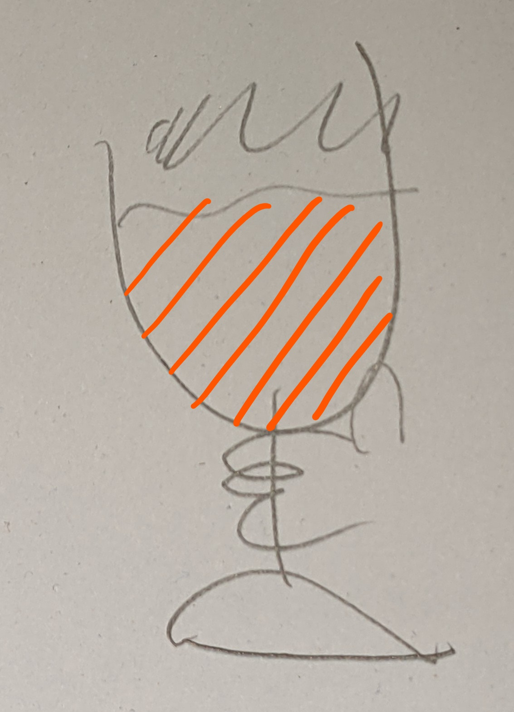
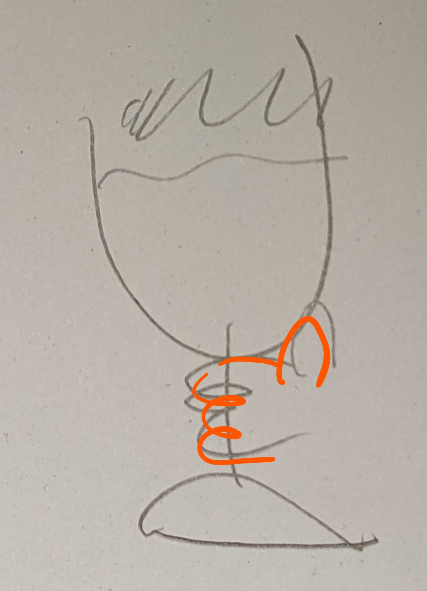

# Testing

https://2020.stateofjs.com/en-US/technologies/testing/

## Quotes
* Justin Searls: We don’t test for testing’s sake (https://www.youtube.com/watch?v=9_3RsSvgRd4&feature=youtu.be)
* Kent Beck : “I get paid for code that works, not for tests”
  * so my philosophy is to test as little as possible to reach a given level of confidence
  * https://istacee.wordpress.com/2013/09/18/kent-beck-i-get-paid-for-code-that-works-not-for-tests/
* Adam Rackis: I read "Clean Code" back in my youthful days—was hooked. I'm so sorry for whoever inherited my code from back then
  * https://twitter.com/AdamRackis/status/1414642471976456193 
  * https://copyconstruct.medium.com/small-functions-considered-harmful-91035d316c29

## Testing on the frontend



* UI is the most volatile, make sure you do not constrain yourself too much
* UI logic is less volatile and might require a bit more testing
* UI obviously is about how graphical elements look like and how they behave
* E2E-Tests are most natural for testing (in the ideal world only, unfortunately)
* They can be slow and brittle and need addition with other forms of testing (order expresses importance)
  * manual
  * type checker
  * unit
  * integration
* quality comes at a cost, you don't become faster when you test more

## Why testing?
* make sure 
  * your program does what it should
  * people can actually use it
  * you can add or refactor code and do not break other parts
* gain insights
  * what should the program actually do?
  * what is its interface so it makes sense to other people
  * is what you build too big or too complex?


## Layers of tests on web front ends

The testing beer glass


### Static tests at the code level

Do not cost a lot, have additional benefits like code completion and documentation.


- https://eslint.org/
  - Won't allow broken code like
    ```let a;
    if (a === 10) {
      useState()
    }
    ```
  - https://create-react-app.dev/docs/setting-up-your-editor/#displaying-lint-output-in-the-editor
- https://www.typescriptlang.org/


### Dynamic tests at code level


- Unit vs Integration Test
  - https://twitter.com/martinfowler/status/1400118938621591552
  - Original definition of Unit test is just "developer test"
  - better definition
    - Solitary (Unit) and
    - Sociable (Integration) tests
  -both potentially with mocking


- https://reactjs.org/docs/testing.html
  - Complete Test solution for React (and others):
    - Test Runner
    - Specs, Assertions, Mocks
    - Code Coverage
    - "Snapshot testing"
- runner for node based unit tests: https://jestjs.io/
  - smoke: does the component render at all (without throwing)?
  - snapshot (https://jestjs.io/docs/en/snapshot-testing, https://reactjs.org/docs/test-renderer.html): 
    - only advisable to use as golden master when checking against external (REST) API 
    - used as consumption test against component lib
      - https://github.com/DJCordhose/frontend-monorepo/blob/main/packages/counter/src/consumption.test.tsx 
  - full: render to HTML and check lifecycle methods
  - logic: pure unit test for reducers
- https://testing-library.com/docs/react-testing-library/intro/
  - Philosophy: tests are written from a user perspective. To find your elements you want to test, you use properties the user also sees (like labels, aria roles, etc)
    - Should make your app better (enforce accessibility) and your tests more stable (don't rely on internal DOM structure etc)
  - Advocates role based selectors
    - https://www.w3.org/TR/wai-aria/#role_definitions
  - testid is alternative (might not be applicable when using component library)
    - https://testing-library.com/docs/dom-testing-library/faq
    - What if my app is localized and I don't have access to the text in test?
      - This is fairly common. Our first bit of advice is to try to get the default text used in your tests. That will make everything much easier (more than just using this utility). If that's not possible, then you're probably best to just stick with data-testids (which is not bad anyway).
  - https://testing-library.com/docs/guide-which-query
- Testing Redux: https://redux.js.org/recipes/writing-tests
  - some basic tests are made obsolete by redux toolkit and TypeScript checking
- Mocking
  - Testing i18n with mocked hook: https://react.i18next.com/misc/testing
  - https://fakerapi.it/en
  - https://github.com/reduxjs/redux-mock-store

- What to test
  - Components
     - Solitary for Dumb Component
       - https://github.com/DJCordhose/frontend-monorepo/blob/main/packages/zeigermann-component-lib/src/AriaButton.test.tsx
     - Sociable for Smart Component
       - https://github.com/DJCordhose/frontend-monorepo/blob/main/packages/counter/src/features/counter/Counter.test.tsx
  - Reducer (Solitary)
    - https://github.com/DJCordhose/frontend-monorepo/blob/main/packages/counter/src/features/counter/counterSlice.test.ts
  - Action Creators (Sociable)
    - https://github.com/DJCordhose/frontend-monorepo/blob/main/packages/counter/src/features/counter/counterSlice.test.ts


### Automatic application-level tests



* should still run even after heavy internal refactoring
* are notorious, but Cypress and Testcafe solve instability problem

#### End-to-End-Tests
* Testcafe
  - https://devexpress.github.io/testcafe/
  - https://testing-library.com/docs/testcafe-testing-library/intro
  - https://devexpress.github.io/testcafe/media/team-blog/randomize-your-end-to-end-tests-how-to-generate-input-data-for-testcafe.html
- https://www.browserstack.com
- Enforce a fixed-time budget
  - E2E suits tend to grow without boundaries
  - when running for ours they become more or less usefless
  - https://www.youtube.com/watch?v=9_3RsSvgRd4&t=989s
  - max. 30 sec before commit
  - max. 30 min in CI

### Visual Regression Tests
- http://yahoo.github.io/blink-diff/
  - https://github.com/yahoo/blink-diff
- https://github.com/tacoss/testcafe-blink-diff

Visual regressions test against a golden master

* create golder master: `yarn e2e:visual:snapshot`
* create test snapshot: `yarn e2e:visual:test`
* compare, create report and fail if deviation is above threshold: `yarn e2e:visual:compare`


### Last Resort: Application-level manual tests



Manual testing on the fully running application


## Storybook: Discovery and documentation for libraries
- https://create-react-app.dev/docs/developing-components-in-isolation/#getting-started-with-storybook
- https://storybook.js.org/
- Contract testing
  - Consumers of lib provide their stories
  - the lib incorporates them if they fit
- Discovery testing
  - What should a component look like? What is its API? How do I implement it?
  - Approach a bit like TDD: What do I want? How and where would I use the component?  

## Other schemas for testing
- overview: https://medium.com/@mateuszroth/why-the-test-pyramid-is-a-bullshit-guide-to-testing-towards-modern-frontend-and-backend-apps-4246e89b87bd
- testing pyramid: https://martinfowler.com/articles/practical-test-pyramid.html
- honeycomb: https://engineering.atspotify.com/2018/01/11/testing-of-microservices/
- testing trophy for frontend
  - https://testingjavascript.com/
  - https://kentcdodds.com/blog/write-tests
