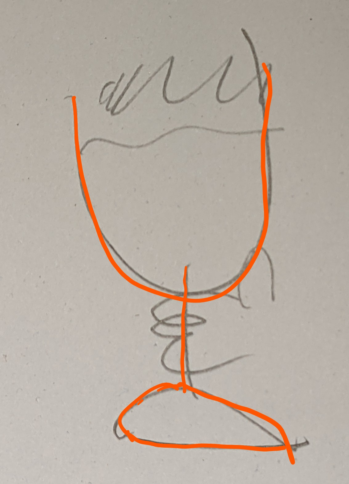

# Testing

https://2020.stateofjs.com/en-US/technologies/testing/

## Testing on the frontend

* UI is the most volatile, make sure you do not constrain yourself too much
* UI logic is less volatile and might require a bit more testing
* UI obviously is about how graphical elements look like and how they behave
* E2E-Tests are most natural for testing (in the ideal world only, unfortunately)
* They can be slow and brittle and need addition with other forms of testing (order expresses importance)
  * manual
  * type checker
  * unit
  * integration

## Layers of tests on web front ends

The testing beer glass

### Static tests at the code level

- https://eslint.org/
- https://www.typescriptlang.org/

### Dynamic tests at code level

Unit(Solitary) and Integration(Sociable) tests, potentially with mocking

- https://reactjs.org/docs/testing.html
- runner for node based unit tests: https://jestjs.io/
  - smoke: does the component render at all (without throwing)?
  - snapshot (https://jestjs.io/docs/en/snapshot-testing, https://reactjs.org/docs/test-renderer.html): only advisable to use as golden master when checking against external (REST) API  
  - full: render to HTML and check lifecycle methods
  - logic: pure unit test for reducers
- https://testing-library.com/docs/react-testing-library/intro/
  - Advocates role based selectors
    - https://www.w3.org/TR/wai-aria/#role_definitions
  - testid is alternative (might not be applicable when using component library)
    - https://testing-library.com/docs/dom-testing-library/faq
    - What if my app is localized and I don't have access to the text in test?
      - This is fairly common. Our first bit of advice is to try to get the default text used in your tests. That will make everything much easier (more than just using this utility). If that's not possible, then you're probably best to just stick with data-testids (which is not bad anyway).
  - https://testing-library.com/docs/guide-which-query
- Testing Redux: https://redux.js.org/recipes/writing-tests
  - some basic tests are made obsolete by redux toolkit and TypeScript checking
- Mocking
  - Testing i18n with mocked hook: https://react.i18next.com/misc/testing
  - https://fakerapi.it/en
  - https://github.com/reduxjs/redux-mock-store

### Automatic application-level tests.

#### End-to-End-Tests
* Testcafe
  - https://devexpress.github.io/testcafe/
  - https://testing-library.com/docs/testcafe-testing-library/intro
  - https://devexpress.github.io/testcafe/media/team-blog/randomize-your-end-to-end-tests-how-to-generate-input-data-for-testcafe.html
- https://www.browserstack.com
- Enforce a fixed-time budget
  - E2E suits tend to grow without boundaries
  - when running for ours they become more or less usefless
  - https://www.youtube.com/watch?v=9_3RsSvgRd4&t=989s
  - max. 30 sec before commit
  - max. 30 min in CI

### Visual Regression Tests
- http://yahoo.github.io/blink-diff/
  - https://github.com/yahoo/blink-diff
- https://github.com/tacoss/testcafe-blink-diff

Visual regressions test against a golden master

* create golder master: `yarn e2e:visual:snapshot`
* create test snapshot: `yarn e2e:visual:test`
* compare, create report and fail if deviation is above threshold: `yarn e2e:visual:compare`

### Last Resort: Application-level manual tests

Manual testing on the fully running application

